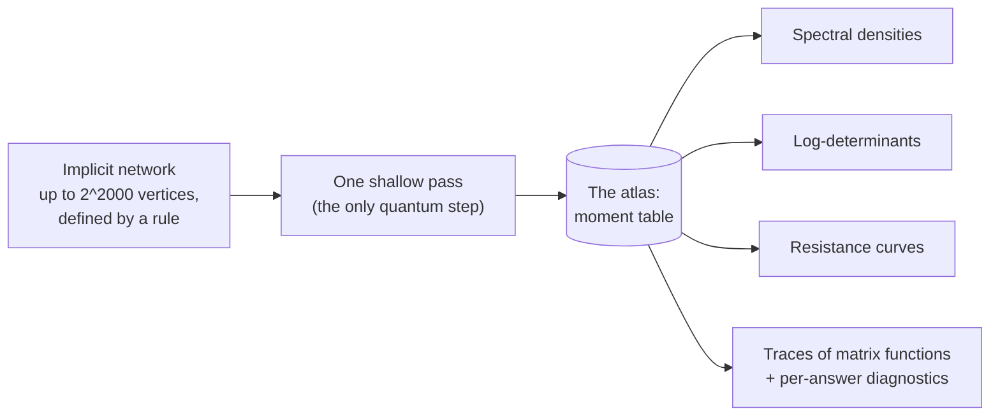

<div align="center">

<picture>
  <source media="(prefers-color-scheme: dark)" srcset="docs/assets/banner-dark.svg">
  
</picture>

# Quantum Spectral Atlases for Exponentially Large Graphs

**Quadratic speedup, query amortization, and shallow circuits**

Kamran Ansari · Stanford University

[](#cite)
[](https://kansari123.github.io/Quantum-Spectral-Atlas-for-Infinitely-Large-Graphs/)
[](#reproduce-in-3-seconds)
[](#reproduce-in-3-seconds)

[**Project page**](https://kansari123.github.io/Quantum-Spectral-Atlas-for-Infinitely-Large-Graphs/) · [**Paper**](#cite) (arXiv, soon) · [**Contact**](mailto:ansarik@stanford.edu)

</div>

---

**One shallow quantum measurement pass per operator → an atlas of spectral moments → hundreds of spectral quantities by classical post-processing, each with a built-in consistency check.** This repository is the public mirror of the paper's arXiv ancillary package: all experiment code, archived datasets, protocols with accuracy criteria fixed before data collection, per-run results, figures, and the IBM hardware notebook.

**Why this is hard.** A network's *spectrum* is the set of numbers that summarizes its global shape: how tightly it is connected, how random walks and diffusion spread across it, its effective-resistance curves and log-determinants. Two situations put the spectrum out of classical reach. First, *implicitly specified* networks, defined by a generating rule (like the product graphs here, with up to 2^2000 vertices), are far too large to ever write down, so any method that touches the whole matrix is ruled out from the start. Second, *signed and magnetic* operators, whose weights mix positive and negative (or complex) entries, defeat the sampling methods that normally rescue you at scale: sampled path contributions arrive with alternating signs and cancel almost perfectly, leaving a signal that drowns in its own noise. This is the sign problem, and on the instances measured here it multiplies the classical sampler's cost by 10^24–10^111.

| **2^2000** | **1 pass** | **≈5,500×** | **10^24–10^111×** |
|:--:|:--:|:--:|:--:|
| vertices in the largest evaluated graphs — defined by a rule, never stored | of quantum measurement per operator; every answer after that is classical | shallower circuits than amplitude estimation requires | classical sampling blow-up on signed operators, while the atlas is unchanged |

## The approach



The protocol builds a *quantum walk* from the operator: a circuit whose step-by-step dynamics mirror the network's structure, constructed directly from the generating rule, so the network itself is never stored. Its state is a *superposition* over all vertices at once, so a depth-D pass coherently combines the contributions of every length-D path through the network, where a classical walker must sample those paths one at a time. One shallow acquisition pass then measures a fixed table of *polynomial moments* of that walk at several resolution levels: coarse levels capture the spectrum's broad shape with very short circuits, and finer levels sharpen it where needed. That table is the **atlas**, and it is the only thing the quantum computer ever produces.

Everything after that is classical post-processing. Because moments are functional-agnostic, the same table is re-read for any target quantity — spectral densities, traces of matrix functions, effective-resistance curves, log-determinants — hundreds of answers at no further quantum cost. Each read-out is solved as a constrained fit that carries its own internal consistency diagnostics, so every answer comes with a check on its own trustworthiness. All of this was validated against independently computed ground truth, with accuracy criteria fixed before data collection.

## Advantage over classical methods

**On implicit, sign-free graphs**, the honest classical competitor is a generic walk-based sampler, which also never stores the network but pays step by step. The quantum walk reaches a given spectral resolution with quadratically fewer steps than that sampler needs — a per-moment gap that is quadratic in resolution, and measured rather than assumed.

**On signed and magnetic operators**, the gap stops being polynomial. Sign cancellations push the measured cost of the classical sampler up by 10^24–10^111× at the required depth, while the quantum walk is sign-blind: signs enter as phases on the superposed amplitudes and are handled by interference rather than by statistical averaging, so its cost and accuracy do not change at all. As a concrete endpoint, a signed operator on ≈10^80 vertices yields its log-determinant to 2.9×10^−14 nats.

**And where classical simply wins:** if the graph is explicit and fits in memory, direct classical solvers remain 10^3–10^5× faster. This protocol is for the regimes where they cannot run.

## Advantage over other quantum methods

Per-query quantum methods attack one functional at a time and pay their full acquisition cost again for every new question. The atlas inverts that economics: it breaks even against per-query sampling at **12–35 questions per operator**, and past break-even the advantage is simply **linear in workload** — 2–30× on this paper's own 26–364-query workloads, ≈87× at a thousand queries, with no ceiling, because additional functionals cost no further quantum steps.

Amplitude estimation is the strongest single-query method: in the fault-tolerant limit it is ≈2.4×10^4× cheaper for one answer. But it buys that with unbroken coherent circuits **≈5,500× deeper** than the atlas runs — beyond any pre-fault-tolerant machine — and the atlas overtakes even amplitude estimation once the workload passes ≈2.4×10^4 questions.

| | Pays per question? | Circuit depth | Best regime |
|---|---|---|---|
| **Per-query sampling** | Yes — full cost every time | Comparable per query | Few questions (< 12–35) of one operator |
| **Amplitude estimation** | Yes | Deep unbroken coherent circuits — fault-tolerant only | Single-query fault-tolerant limit (≈2.4×10^4× cheaper there) |
| **This atlas** | No — one pass, then classical | ≈5,500× shallower than amplitude estimation | Many questions of one operator; advantage grows linearly, overtakes amplitude estimation past ≈2.4×10^4 |

## Results

<table>
<tr><td colspan="2" align="center"><br/><sub><b>Against other quantum methods.</b> Break-even and scaling vs per-query sampling and amplitude estimation, at measured device constants — including where the atlas loses.</sub></td></tr>
<tr>
<td width="50%" align="center"><br/><sub><b>Graphs that can never be stored.</b> Validated against independent ground truth through 2^2000 vertices.</sub></td>
<td width="50%" align="center"><br/><sub><b>Where classical sampling dies.</b> Signed and magnetic operators: sampler cost ×10^24–10^111; the atlas unchanged.</sub></td>
</tr>
<tr><td colspan="2" align="center"><br/><sub><b>Under noise.</b> Accuracy under injected per-moment noise — the model later measured directly on IBM Heron hardware (order k = 8; median curve error 5.2% signed, 9.7% unsigned).</sub></td></tr>
</table>

> [!IMPORTANT]
> **Honest scope.** The protocol wins on implicitly specified and signed operators with many-query workloads. It does **not** win on explicit graphs that fit in memory (classical solvers stay 10^3–10^5× faster), below the 12–35-query break-even, or in the single-query fault-tolerant limit (amplitude estimation is ≈2.4×10^4× cheaper there). No hardness is claimed for any executed instance; all validation instances are classically checkable by construction.

## Reproduce in ~3 seconds

Verified end-to-end in a clean environment. Python 3 with `numpy` and `scipy`; the archived datasets ship inside the tarball, so there is nothing to download:

```bash
mkdir work && cd work
tar -xzf ../expG/expG_code_checkpoints.tar.gz   # code + archived datasets
cp ../expG2/g2_main.py ../expG/res_sbm.json .
python3 g2_main.py                               # ~3 s; prints MAIN G2 DONE on success
```

The other experiment scripts follow the same working-directory pattern. The hardware notebook's acquisition cells require IBM Quantum access; the reanalysis script reproduces the run-2 analysis from cached results without any QPU.

<details>
<summary><b>Repository layout</b></summary>

| Path | Contents |
|---|---|
| `expG/` | Explicit-graph experiments: the LastFM social network (7,624 nodes) and a designed stochastic block model. Code and archived datasets in `expG_code_checkpoints.tar.gz`; per-run results, protocol files, figures. |
| `expG2/` | Leverage-weighted port-selection follow-up on the same instances. |
| `expH/` | Implicitly specified product graphs with up to 2^2000 vertices. |
| `expI/` | Signed and magnetic operators (flux-threaded tori; a signed operator on ≈10^80 vertices), with path-sampler baselines. |
| `expJ/` | Hardness construction and quantum-comparison worked constants and cost tables. |
| `qpvl_ibm_hardware_validation.ipynb` | IBM hardware acquisition and analysis notebook (two-processor characterization on IBM Heron devices). |
| `qpvl_run2_reanalysis_cell.py` | Self-contained zero-QPU reanalysis of the cached hardware run. |
| `figs/` | The seven figures as they appear in the paper. |
| `docs/` | Source of the project page. |
| `README.txt` | The original ancillary README shipped with the arXiv package. |

</details>

<details>
<summary><b>File conventions &amp; ground truth</b></summary>

Inside each experiment directory: `registration_*.md` — protocol and quantitative accuracy criteria, fixed before data collection · `results_*.md` — outcome ledgers · `res_*.json` — machine-readable results.

Ground truth is dual-generator with cross-checks at or below 1e-9 throughout; instance-generator seeds are listed in the paper's Data and code availability section.

</details>

## Cite

Until the arXiv identifier is live:

```bibtex
@misc{ansari2026spectralatlases,
  title  = {Quantum Spectral Atlases for Exponentially Large Graphs:
            Quadratic Speedup, Query Amortization, and Shallow Circuits},
  author = {Ansari, Kamran},
  year   = {2026},
  note   = {arXiv preprint; identifier to be added}
}
```

**Related:** [A Quantum Moment Atlas for Reinforcement Learning](https://github.com/kansari123/A-Quantum-Moment-Atlas-for-Reinforcement-Learning) — the same engine applied to policy evaluation across discount factors.
