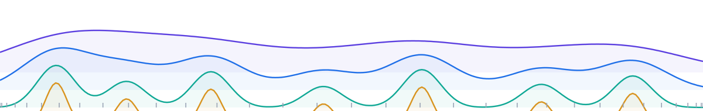
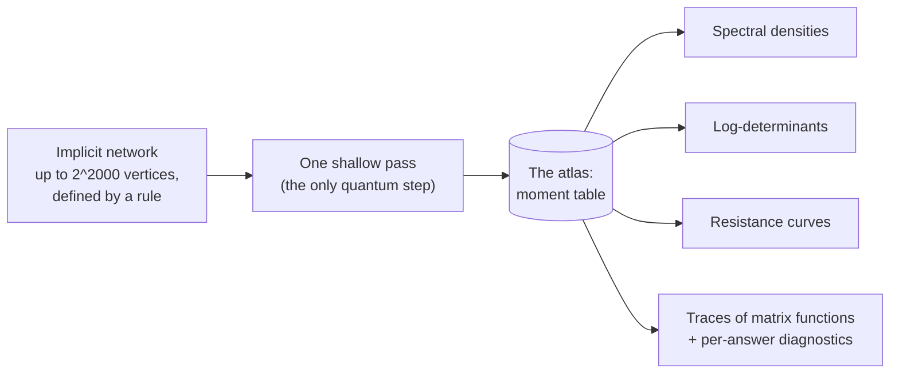
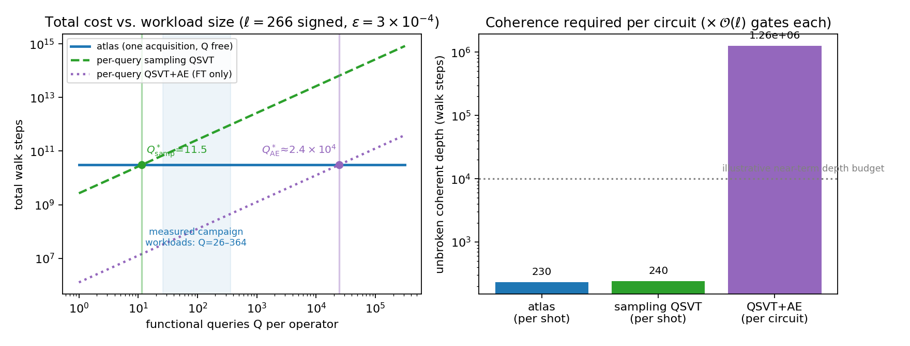
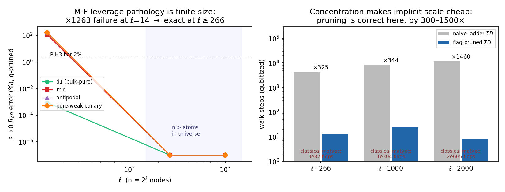
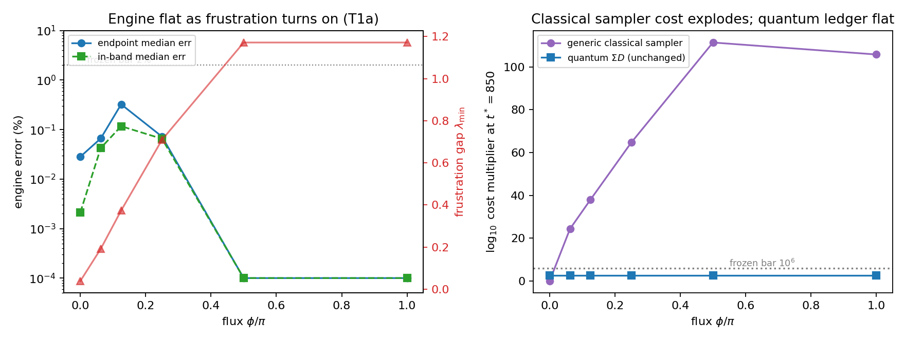
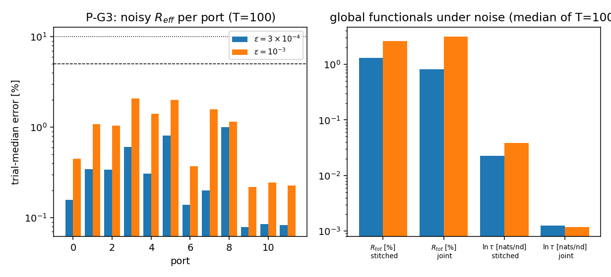

<div align="center">

<picture>
  <source media="(prefers-color-scheme: dark)" srcset="docs/assets/banner-dark.svg">
  
</picture>

# Quantum Spectral Atlases for Exponentially Large Graphs

**Quadratic speedup, query amortization, and shallow circuits**

Kamran Ansari · Stanford University

[](#cite)
[](https://kansari123.github.io/Quantum-Spectral-Atlas-for-Infinitely-Large-Graphs/)
[](#reproduce-in-3-seconds)
[](#reproduce-in-3-seconds)

[**Project page**](https://kansari123.github.io/Quantum-Spectral-Atlas-for-Infinitely-Large-Graphs/) · [**Paper**](#cite) (arXiv, soon) · [**Contact**](mailto:ansarik@stanford.edu)

</div>

---

**One shallow quantum measurement pass per operator → an atlas of spectral moments → hundreds of spectral quantities by classical post-processing, each with a built-in consistency check.** This repository is the public mirror of the paper's arXiv ancillary package: all experiment code, archived datasets, protocols with accuracy criteria fixed before data collection, per-run results, figures, and the IBM hardware notebook.

| **2^2000** | **1 pass** | **≈5,500×** | **10^24–10^111×** |
|:--:|:--:|:--:|:--:|
| vertices in the largest evaluated graphs — defined by a rule, never stored | of quantum measurement per operator; every answer after that is classical | shallower circuits than amplitude estimation requires | classical sampling blow-up on signed operators, while the atlas is unchanged |

## How it works



Measure once, re-read forever: additional spectral questions cost no further quantum steps. Past the measured break-even of 12–35 queries per operator, the advantage grows linearly with workload (2–30× on the paper's own 26–364-query workloads).

## Results

<table>
<tr><td colspan="2" align="center"><br/><sub><b>Against other quantum methods.</b> Break-even and scaling vs per-query sampling and amplitude estimation, at measured device constants — including where the atlas loses.</sub></td></tr>
<tr>
<td width="50%" align="center"><br/><sub><b>Graphs that can never be stored.</b> Validated against independent ground truth through 2^2000 vertices.</sub></td>
<td width="50%" align="center"><br/><sub><b>Where classical sampling dies.</b> Signed and magnetic operators: sampler cost ×10^24–10^111; the atlas unchanged.</sub></td>
</tr>
<tr><td colspan="2" align="center"><br/><sub><b>Under noise.</b> Accuracy under injected per-moment noise — the model later measured directly on IBM Heron hardware (order k = 8; median curve error 5.2% signed, 9.7% unsigned).</sub></td></tr>
</table>

> [!IMPORTANT]
> **Honest scope.** The protocol wins on implicitly specified and signed operators with many-query workloads. It does **not** win on explicit graphs that fit in memory (classical solvers stay 10^3–10^5× faster), below the 12–35-query break-even, or in the single-query fault-tolerant limit (amplitude estimation is ≈2.4×10^4× cheaper there). No hardness is claimed for any executed instance; all validation instances are classically checkable by construction.

## Reproduce in ~3 seconds

Verified end-to-end in a clean environment. Python 3 with `numpy` and `scipy`; the archived datasets ship inside the tarball, so there is nothing to download:

```bash
mkdir work && cd work
tar -xzf ../expG/expG_code_checkpoints.tar.gz   # code + archived datasets
cp ../expG2/g2_main.py ../expG/res_sbm.json .
python3 g2_main.py                               # ~3 s; prints MAIN G2 DONE on success
```

The other experiment scripts follow the same working-directory pattern. The hardware notebook's acquisition cells require IBM Quantum access; the reanalysis script reproduces the run-2 analysis from cached results without any QPU.

<details>
<summary><b>Repository layout</b></summary>

| Path | Contents |
|---|---|
| `expG/` | Explicit-graph experiments: the LastFM social network (7,624 nodes) and a designed stochastic block model. Code and archived datasets in `expG_code_checkpoints.tar.gz`; per-run results, protocol files, figures. |
| `expG2/` | Leverage-weighted port-selection follow-up on the same instances. |
| `expH/` | Implicitly specified product graphs with up to 2^2000 vertices. |
| `expI/` | Signed and magnetic operators (flux-threaded tori; a signed operator on ≈10^80 vertices), with path-sampler baselines. |
| `expJ/` | Hardness construction and quantum-comparison worked constants and cost tables. |
| `qpvl_ibm_hardware_validation.ipynb` | IBM hardware acquisition and analysis notebook (two-processor characterization on IBM Heron devices). |
| `qpvl_run2_reanalysis_cell.py` | Self-contained zero-QPU reanalysis of the cached hardware run. |
| `figs/` | The seven figures as they appear in the paper. |
| `docs/` | Source of the project page. |
| `README.txt` | The original ancillary README shipped with the arXiv package. |

</details>

<details>
<summary><b>File conventions &amp; ground truth</b></summary>

Inside each experiment directory: `registration_*.md` — protocol and quantitative accuracy criteria, fixed before data collection · `results_*.md` — outcome ledgers · `res_*.json` — machine-readable results.

Ground truth is dual-generator with cross-checks at or below 1e-9 throughout; instance-generator seeds are listed in the paper's Data and code availability section.

</details>

## Cite

Until the arXiv identifier is live:

```bibtex
@misc{ansari2026spectralatlases,
  title  = {Quantum Spectral Atlases for Exponentially Large Graphs:
            Quadratic Speedup, Query Amortization, and Shallow Circuits},
  author = {Ansari, Kamran},
  year   = {2026},
  note   = {arXiv preprint; identifier to be added}
}
```

**Related:** [A Quantum Moment Atlas for Reinforcement Learning](https://github.com/kansari123/A-Quantum-Moment-Atlas-for-Reinforcement-Learning) — the same engine applied to policy evaluation across discount factors.
